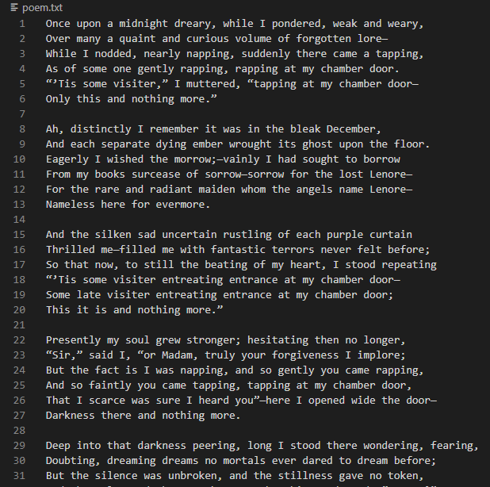
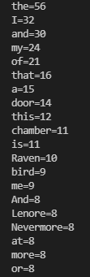
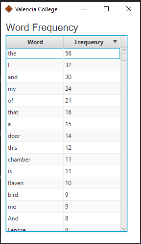

# Assignment Description
Write a text analyzer that reads a file and outputs statistics about that file. It should output the word frequencies of all words in the file, sorted by the most frequently used word. The output should be a set of pairs, each pair containing a word and how many times it occurred in the file.

## Assignment Solution

### Requirements:
* Read text from a file
* Calculate word frequency
* Output the 20 most frequently used words

### Design:
* Use the Scanner Class to read the file
* Clean all special characters off the text
* Store each word in an array
* Create a TreeMap and iterate through the array, if the word is in the TreeMap, increment the counter; else, add the word and set the counter to one
* Sort the output with .entrySet() method, comparing by value

### Input and Output:
Input:
* The Raven by Edgar Allan Poe:

Output:

 
